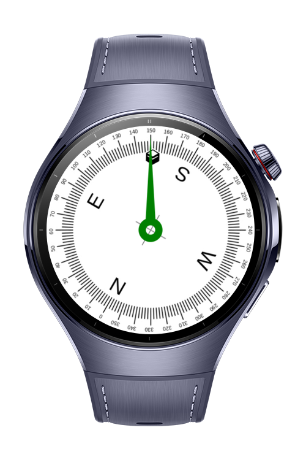
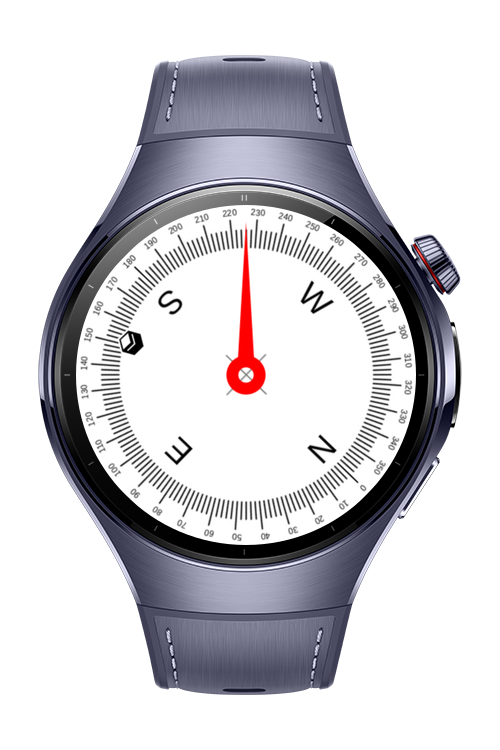

> **Note:** To access all shared projects, get information about environment setup, and view other guides, please visit [Explore-In-HMOS-Wearable Index](https://github.com/Explore-In-HMOS-Wearable/hmos-index).


# Qibla Finder

**Qibla Finder** is a sample HarmonyOS wearable application that helps users find the Qibla direction.

# Preview

<p align="left">
    
    
</p>

# Use Cases

1. Users can detect Qibla direction
2. The app can be used as a compass app.

# Tech Stack

**Languages**: ArkTS, ArkUI  
**Frameworks**: HarmonyOS SDK 5.1.0  
**Tools**: DevEco Studio 6.0.0  
**Libraries/Kits**:
- @kit.LocationKit
- @kit.SensorServiceKit
- @ohos.events.emitter
- @kit.PerformanceAnalysisKit
- @kit.ArkUI
- @kit.AbilityKit
- @kit.BasicServicesKit

# Required Permissions

- `ohos.permission.LOCATION`
  > Required to get location information.
- `ohos.permission.APPROXIMATELY_LOCATION`
  > Required to get approximate location.
- `ohos.permission.GYROSCOPE`
  > Required to use rotation vector


# Directory Structure

```
entry/src/main/ets/
├─── entryability
│    └── EntryAbility.ets
└──── pages
     └── Index.ets
```

# Constraints and Restrictions

## Supported Devices

- Huawei Watch 5

## Limitations

- The app is not working on previewer or simulators (rotation vector is not supported in emulator)
- Users need to apply location permissions and enable location in smart watch

# License

**Qibla Finder** is distributed under the terms of the MIT License
See the [LICENSE](LICENSE) for more information.
